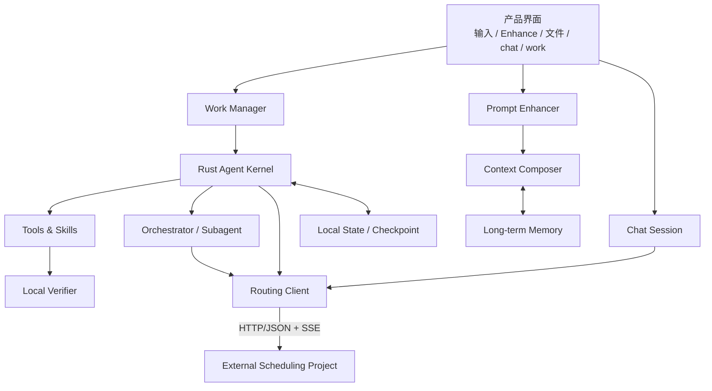

# Agent 总体架构

## 目标

Agent 侧把复杂执行能力包装成普通用户可以直接使用的 chat/work 产品。模型选择由外部中转调度项目负责；本侧专注用户上下文、任务执行、文件、工具、状态、验证和记忆。

## 模块图

## 模块职责

| 模块 | 职责 | 权威文档 |
|---|---|---|
| Product Shell | 面向用户的输入、文件、进度、确认和交付 | [`../product/product-experience.md`](../product/product-experience.md) |
| Prompt Enhancer | 在提交前基于合理上下文优化草稿 | [`prompt-enhancing.md`](prompt-enhancing.md) |
| Context Composer | Chat/Work 共用的历史投影、文件检索与 hydration | [`prompt-enhancing-context-pipeline.md`](prompt-enhancing-context-pipeline.md) |
| Work Manager | 无项目任务、文件上下文和产物 | [`work-and-files.md`](work-and-files.md) |
| Agent Kernel | Agent Loop、状态机、恢复 | [`agent-runtime.md`](agent-runtime.md) |
| Orchestrator | Subagent 创建、隔离和合并 | [`orchestration.md`](orchestration.md) |
| Local Verifier | 本地结果验收，不参与路由 | [`verification-and-effects.md`](verification-and-effects.md) |
| Memory | 长期记忆产品能力 | [`memory.md`](memory.md) |
| Routing Client | 路由信号和外部接口适配 | [`routing-signals.md`](routing-signals.md) |
| Control | 文件、动作和敏感数据边界 | [`security-and-data-boundary.md`](security-and-data-boundary.md) |
| Tools & Skills | agent 影响外部世界的能力 | [`tools-and-skills.md`](tools-and-skills.md) |

## 两条主路径

### Chat

输入草稿可先经 Prompt Enhancing；提交后，每次 chat 请求由调度侧生成路由信号并选择模型。chat 保持会话上下文，但不进入完整执行型 Agent Loop。

### Work

用户直接描述任务并引入资料。Work Manager 建立独立 Work Context；Agent Kernel 计划、调用工具、必要时创建 Subagent、本地验证并交付。work 不依赖 Project 对象。

## 明确边界

- agent 不训练模型，不生成训练集，不上传路由遥测。
- agent 不设计或复现调度侧的 benchmark、成本权重和运营策略。
- 本地验证只用于任务完成判断。
- checkpoint、权限审计和验证证据属于本地运行状态。
