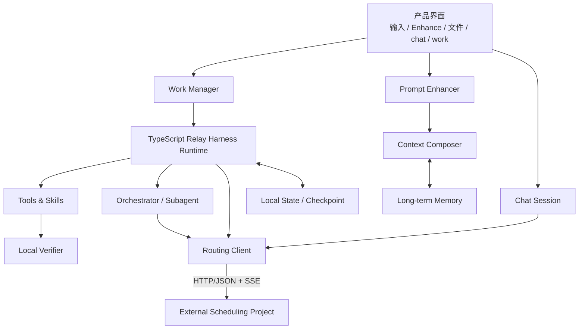

# Agent Architecture Overview

English | [中文](overview.zh.md)

## Goal

The agent side packages complex execution as a Chat/Work product ordinary users can use directly. The external scheduling project selects models; this side owns user context, task execution, files, tools, state, verification, and memory.

## Module diagram

## Module responsibilities

| Module | Responsibility | Authority |
|---|---|---|
| Product Shell | User-facing input, files, progress, confirmation, and delivery | [`../product/product-experience.md`](../product/product-experience.md) |
| Prompt Enhancer | Improve a draft from reasonable context before submission | [`prompt-enhancing.md`](prompt-enhancing.md) |
| Context Composer | Shared Chat/Work history projection, file retrieval, and hydration | [`prompt-enhancing-context-pipeline.md`](prompt-enhancing-context-pipeline.md) |
| Work Manager | Project-free tasks, file context, and artifacts | [`work-and-files.md`](work-and-files.md) |
| Agent Kernel | Agent loop, state machine, and recovery | [`agent-runtime.md`](agent-runtime.md) |
| Orchestrator | Subagent creation, isolation, and merge | [`orchestration.md`](orchestration.md) |
| Local Verifier | Local result acceptance independent from routing | [`verification-and-effects.md`](verification-and-effects.md) |
| Memory | Long-term memory product capability | [`memory.md`](memory.md) |
| Routing Client | Routing signals and external-interface adaptation | [`routing-signals.md`](routing-signals.md) |
| Control | File, action, and sensitive-data boundaries | [`security-and-data-boundary.md`](security-and-data-boundary.md) |
| Tools & Skills | Capabilities through which the agent affects the external world | [`tools-and-skills.md`](tools-and-skills.md) |

## Two primary paths

### Chat

An input draft may pass through Prompt Enhancement first. After submission, scheduling generates a routing signal and selects a model for each Chat request. Chat preserves session context without entering the complete execution-oriented agent loop.

### Work

The user describes a task and introduces material directly. Work Manager creates an independent Work Context; Agent Kernel plans, calls tools, creates subagents when needed, verifies locally, and delivers. Work does not depend on a Project object.

## Explicit boundaries

- The agent does not train models, generate training sets, or upload routing telemetry.
- The agent does not design or reproduce scheduling benchmarks, cost weights, or operating policy.
- Local verification serves only task-completion decisions.
- Checkpoints, permission audits, and verification Evidence belong to local run state.
