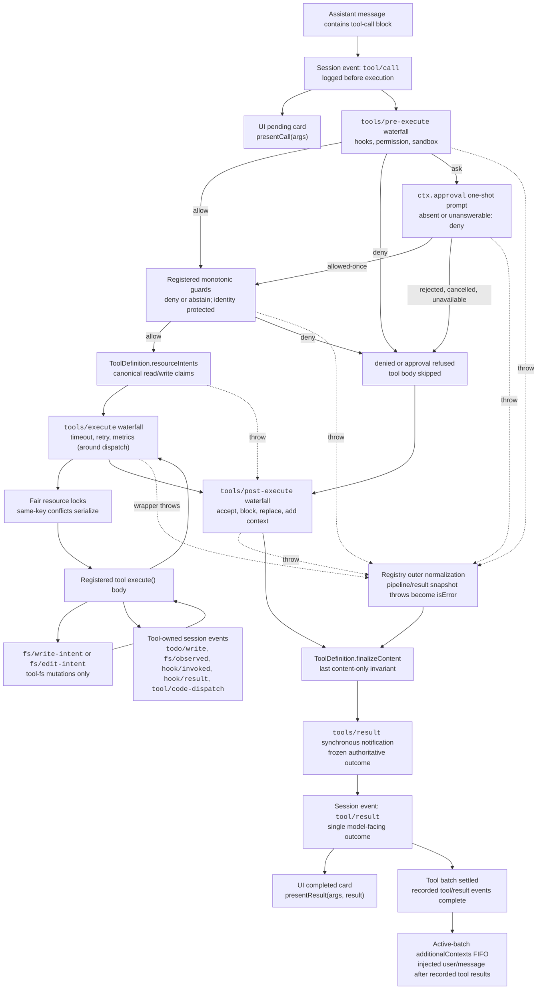

<!-- Generated by scripts/gen-doc-graphs.ts - do not edit by hand.
     Run `pnpm run gen-doc-graphs` to regenerate. -->

# Tool Execution Pipeline

This graph shows where policy, hooks, sandboxing, resource coordination, filesystem guards, result rewriting, final-outcome observation, and UI rendering run without changing the loop. The `tools/pre-execute` waterfall and monotonic guards run first, `ToolDefinition.resourceIntents` resolves canonical claims, and the `tools/execute` and `tools/post-execute` waterfalls follow. Definition-owned `finalizeContent` and `tools/result` run afterward.

Filesystem read-before-edit checks stay below `tool-fs` on `fs/*` events. Generic pre/post waterfalls host hooks and approval policy; `ctx.approval` resolves asks before monotonic guards, and owner policy that must not be reordered remains a registered guard. Resource resolvers perform identity lookup after policy; acquisition occurs inside the overlapping dispatch stage immediately before the body, so a blocked key does not occupy the ordered prepare lane. Around-dispatch concerns such as timeouts wrap both lock waiting and the body through `tools/execute`. The registry losslessly snapshots the candidate result and normalizes a snapshot failure before the visible definition's snapshotted `finalizeContent` callback enforces its synchronous content-only invariant. `tools/result` then observes the immutable, lossless-JSON outcome. Code Mode sends both the reserved `run_code` transport and its sub-calls through the same snapshot, locks, and pipeline.

Maintenance mode: curated Mermaid flow; exact tool schemas and event signatures live in generated catalogs.
