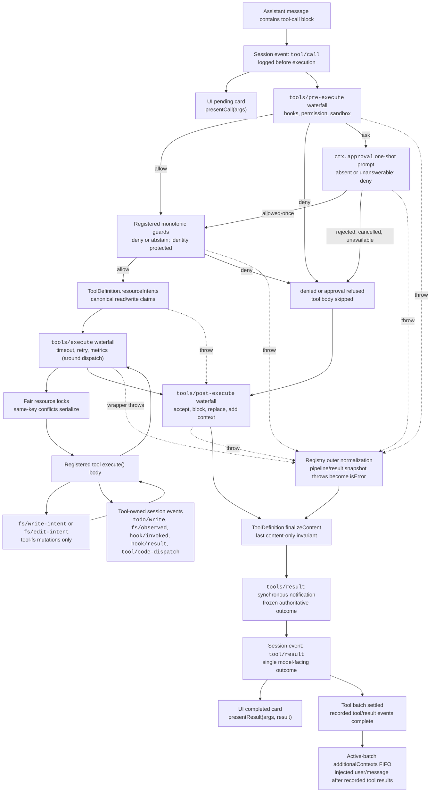

<!-- 英文源文件由 scripts/gen-doc-graphs.ts 生成；本中文文件是通过双语配对维护的经评审对侧。
     更新时先运行 `pnpm run gen-doc-graphs` 更新英文，再更新本文件并运行 `pnpm run verify-translation-pairing --write docs/tool-execution-pipeline.md` 重新记录配对。 -->

# 工具执行流水线

[English](tool-execution-pipeline.md) | 中文

此图展示策略、钩子、沙箱、资源协调、文件系统守卫、结果重写、最终结果观察和 UI 渲染在不改变循环的情况下何时运行。`tools/pre-execute` waterfall 与单调 guard 首先运行，`ToolDefinition.resourceIntents` 随后解析规范 claim，接着运行 `tools/execute` 与 `tools/post-execute` waterfall。由定义自身控制的 `finalizeContent` 与 `tools/result` 在此之后运行。

文件系统的先读后编辑检查位于 `tool-fs` 之下，通过 `fs/*` 事件实现。通用前置／后置 waterfall 承载 hook 与审批 policy；`ctx.approval` 在单调 guard 之前处理询问，而不得重新排序的所有者 policy 仍作为已注册 guard。资源 resolver 在 policy 后执行身份查找；资源获取发生在可重叠 dispatch 阶段内、紧邻主体之前，因此被某个 key 阻塞不会占据有序 prepare lane。超时等环绕分发关注点会通过 `tools/execute` 同时包装锁等待与主体。注册表会对候选结果进行无损快照；快照失败会先被规范化，之后再由可见定义中随快照固定的 `finalizeContent` 回调强制执行同步且仅限内容的不变式。随后，`tools/result` 观察不可变、可由 JSON 无损表示的结果。Code Mode 会让保留的 `run_code` 传输及其子调用经过同一快照、锁和流水线。

维护模式：英文源文件包含人工维护的 Mermaid 流程图，并由生成器写出；本中文文件作为经评审对侧通过双语配对维护。确切的工具 schema 与事件签名位于生成的目录中。
