<!-- Generated by scripts/gen-doc-graphs.ts - do not edit by hand.
     Run `pnpm run gen-doc-graphs` to regenerate. -->

# Headless Agent Snapshot Composition

The headless snapshot composition combines the real DeepSeek adapter and coding capabilities with one explicitly configured persisted top-level agent; its JSONL driver is test-only.

```mermaid
flowchart LR
  cfg["examples/headless-agent<br/>cordis.yml"]
  plugin_headless_settings["settings<br/>@relay-harness/rlh-settings-file"]
  cfg --> plugin_headless_settings
  plugin_headless_credentials["credentials<br/>@relay-harness/rlh-credentials-local"]
  cfg --> plugin_headless_credentials
  plugin_headless_llm_deepseek["llm-deepseek<br/>@relay-harness/rlh-llm-deepseek"]
  cfg --> plugin_headless_llm_deepseek
  plugin_headless_subprocess["subprocess<br/>@relay-harness/rlh-subprocess-local"]
  cfg --> plugin_headless_subprocess
  plugin_headless_bash["bash<br/>@relay-harness/rlh-bash-local"]
  cfg --> plugin_headless_bash
  plugin_headless_agent_spine["agent-spine<br/>@relay-harness/rlh-agent-spine-demo"]
  cfg --> plugin_headless_agent_spine
  plugin_headless_persistence["persistence<br/>@relay-harness/rlh-session-persistence-jsonl"]
  cfg --> plugin_headless_persistence
  plugin_headless_checkpoint_policy["checkpoint-policy<br/>@relay-harness/rlh-session-checkpoint-policy"]
  cfg --> plugin_headless_checkpoint_policy
  plugin_headless_token_meter["token-meter<br/>@relay-harness/rlh-token-meter"]
  cfg --> plugin_headless_token_meter
  plugin_headless_compaction_basic["compaction-basic<br/>@relay-harness/rlh-compaction-basic"]
  cfg --> plugin_headless_compaction_basic
  plugin_headless_session_projection["session-projection<br/>@relay-harness/rlh-session-projection"]
  cfg --> plugin_headless_session_projection
  plugin_headless_subagent["subagent<br/>@relay-harness/rlh-subagent"]
  cfg --> plugin_headless_subagent
  plugin_headless_subagent_spawn_in_process["subagent-spawn-in-process<br/>@relay-harness/rlh-subagent-spawn-in-process"]
  cfg --> plugin_headless_subagent_spawn_in_process
  plugin_headless_subagent_fork_in_process["subagent-fork-in-process<br/>@relay-harness/rlh-subagent-fork-in-process"]
  cfg --> plugin_headless_subagent_fork_in_process
  plugin_headless_tool_subagent_control["tool-subagent-control<br/>@relay-harness/rlh-tool-subagent-control"]
  cfg --> plugin_headless_tool_subagent_control
  plugin_headless_tool_subagent_report["tool-subagent-report<br/>@relay-harness/rlh-tool-subagent-report"]
  cfg --> plugin_headless_tool_subagent_report
  plugin_headless_tool_subagent["tool-subagent<br/>@relay-harness/rlh-tool-subagent"]
  cfg --> plugin_headless_tool_subagent
  plugin_headless_tool_subagent_fork["tool-subagent-fork<br/>@relay-harness/rlh-tool-subagent"]
  cfg --> plugin_headless_tool_subagent_fork
  plugin_headless_workflow_worker_thread["workflow-worker-thread<br/>@relay-harness/rlh-workflow-worker-thread"]
  cfg --> plugin_headless_workflow_worker_thread
  plugin_headless_tool_workflow["tool-workflow<br/>@relay-harness/rlh-tool-workflow"]
  cfg --> plugin_headless_tool_workflow
  plugin_headless_tool_ralph["tool-ralph<br/>@relay-harness/rlh-tool-ralph"]
  cfg --> plugin_headless_tool_ralph
  plugin_headless_tool_todo["tool-todo<br/>@relay-harness/rlh-tool-todo"]
  cfg --> plugin_headless_tool_todo
  plugin_headless_fs_local["fs-local<br/>@relay-harness/rlh-fs-local"]
  cfg --> plugin_headless_fs_local
  plugin_headless_fs_observation_policy["fs-observation-policy<br/>@relay-harness/rlh-fs-observation-policy"]
  cfg --> plugin_headless_fs_observation_policy
  plugin_headless_tool_fs["tool-fs<br/>@relay-harness/rlh-tool-fs"]
  cfg --> plugin_headless_tool_fs
```

| Plugin id | Package / module |
| --- | --- |
| `settings` | `@relay-harness/rlh-settings-file` |
| `credentials` | `@relay-harness/rlh-credentials-local` |
| `llm-deepseek` | `@relay-harness/rlh-llm-deepseek` |
| `subprocess` | `@relay-harness/rlh-subprocess-local` |
| `bash` | `@relay-harness/rlh-bash-local` |
| `agent-spine` | `@relay-harness/rlh-agent-spine-demo` |
| `persistence` | `@relay-harness/rlh-session-persistence-jsonl` |
| `checkpoint-policy` | `@relay-harness/rlh-session-checkpoint-policy` |
| `token-meter` | `@relay-harness/rlh-token-meter` |
| `compaction-basic` | `@relay-harness/rlh-compaction-basic` |
| `session-projection` | `@relay-harness/rlh-session-projection` |
| `subagent` | `@relay-harness/rlh-subagent` |
| `subagent-spawn-in-process` | `@relay-harness/rlh-subagent-spawn-in-process` |
| `subagent-fork-in-process` | `@relay-harness/rlh-subagent-fork-in-process` |
| `tool-subagent-control` | `@relay-harness/rlh-tool-subagent-control` |
| `tool-subagent-report` | `@relay-harness/rlh-tool-subagent-report` |
| `tool-subagent` | `@relay-harness/rlh-tool-subagent` |
| `tool-subagent-fork` | `@relay-harness/rlh-tool-subagent` |
| `workflow-worker-thread` | `@relay-harness/rlh-workflow-worker-thread` |
| `tool-workflow` | `@relay-harness/rlh-tool-workflow` |
| `tool-ralph` | `@relay-harness/rlh-tool-ralph` |
| `tool-todo` | `@relay-harness/rlh-tool-todo` |
| `fs-local` | `@relay-harness/rlh-fs-local` |
| `fs-observation-policy` | `@relay-harness/rlh-fs-observation-policy` |
| `tool-fs` | `@relay-harness/rlh-tool-fs` |

Source config: [`examples/headless-agent/cordis.yml`](cordis.yml).

Maintenance mode: hybrid: the leaf plugin list is parsed from its `cordis.yml`; app package expansion is curated from package source.
