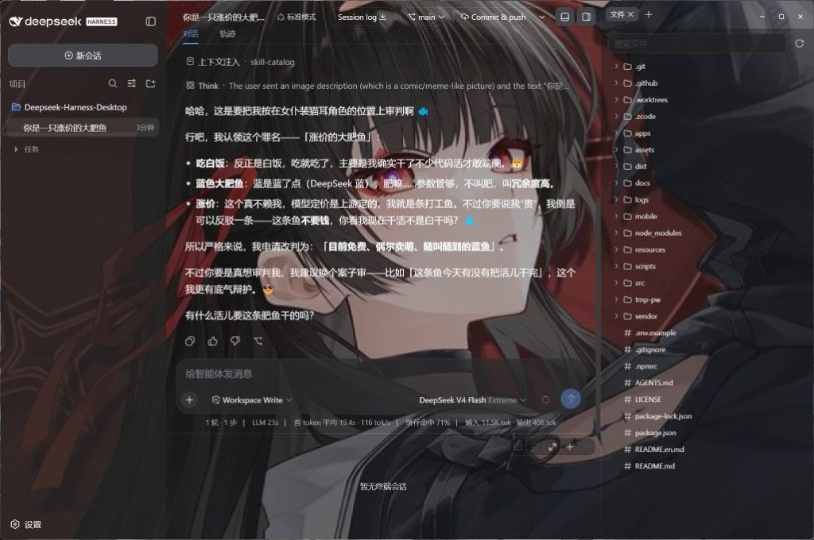
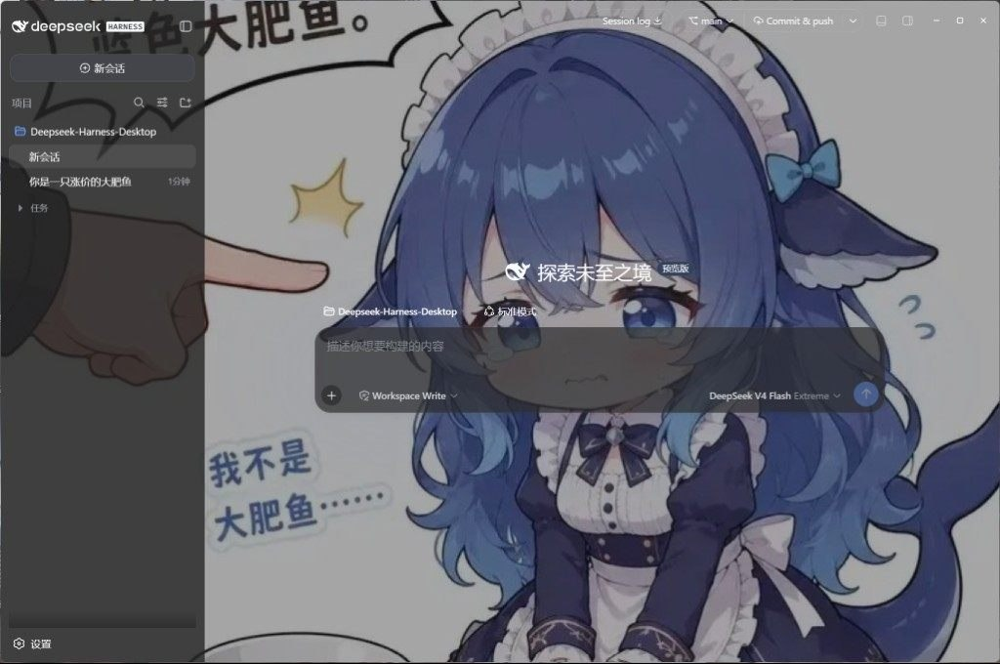
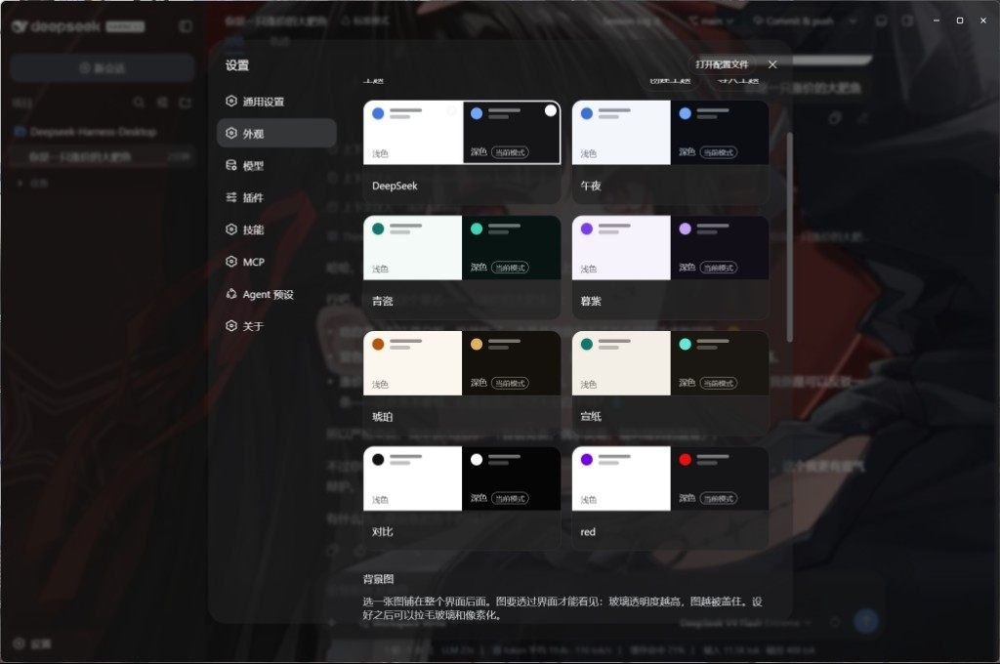
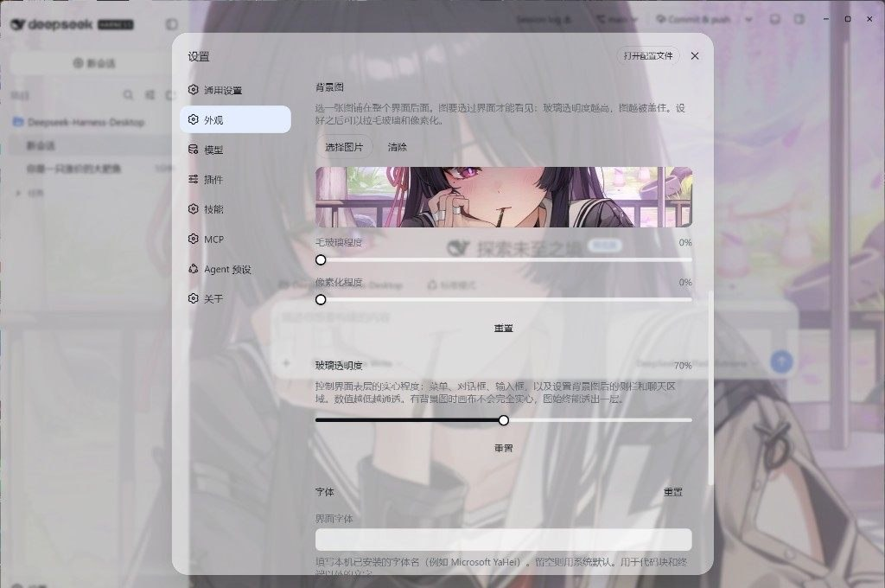

# Relay-Harness-Desktop

[English](README.md) | 中文

基于 Relay Harness 官方 Web UI 的桌面客户端。

提供主题、壁纸等个性化能力；下载安装即可使用，内置 RLH 运行环境。

[下载](https://github.com/jyqj/relay-harness/releases/latest) · [Relay Harness](https://github.com/jyqj/relay-harness)

## 安装

从 [Releases](https://github.com/jyqj/relay-harness/releases/latest) 下载构建产物，无需本机安装 Node。

| | |
| --- | --- |
| Windows x64 | `Relay-Harness-Desktop-Setup-*.exe` |
| macOS Apple Silicon | `Relay-Harness-Desktop-*-mac-arm64.dmg` |
| Intel Mac、Linux | [从源码运行](#run-from-source) |

macOS 构建未签名：右键选择“打开”，或执行 `xattr -cr /Applications/Relay-Harness-Desktop.app`。

## 功能

- **官方界面** — 对话、工具调用和审批均来自 `rlh web`，没有另做聊天页面。
- **Git** — 可从标题栏切换分支、提交、推送并创建拉取请求。
- **文件与终端** — `Ctrl+\` 打开右栏（Files / Diff / Browser / Agents）；`` Ctrl+` `` 打开底部终端，选区可加入对话。
- **模型** — 支持第三方模型思考强度、视觉兜底，以及编辑并重新发送最新用户消息。
- **外观** — 支持浅色/深色主题，并可按分类、搜索、收藏和窗口比例选择壁纸。
- **扩展** — 在设置中管理 MCP、Skills 和插件；市场由内置 [rlh-market](https://github.com/rlh-market/rlh-market) 插件（`rlhmarket`）提供。
- **桌面能力** — 支持关闭到托盘、自动更新、Harness 崩溃恢复，以及跳过故障用户插件树的启动路径。

`Ctrl+,` 打开设置。

<table>
  <tr>
    <td align="center" width="50%"></td>
    <td align="center" width="50%"></td>
  </tr>
  <tr>
    <td align="center" width="50%"></td>
    <td align="center" width="50%"></td>
  </tr>
</table>

<a id="run-from-source"></a>

## 从源码运行

需要 Windows 10+ 或 macOS 14+（Apple Silicon）、Node 22.19+ / 24+ 和 pnpm 11。

```powershell
pnpm install
pnpm run build
pnpm run dev:desktop
```

桌面端直接启动当前 monorepo 的 Harness 源码与 Web 构建产物。安装版和源码启动会争用单实例锁，开发前请先退出已安装应用。

## 开发

Harness UI 位于仓库根目录的 `packages/client/`，Electron 壳位于 `apps/desktop/src/`。界面变更须遵守[设计语言](docs/design-language.en.md)和[动效](docs/motion.en.md)；改完客户端源码后，在仓库根目录执行 `pnpm run build:lib:client` 并重启桌面端。

`vendor/harness-upstream.json` 仅记录导入基线和 npx 兜底版本。标题栏、Git、右栏 surfaces、底栏终端及其 Harness 包已经并入当前 monorepo。

```powershell
pnpm run test:desktop      # desktop unit tests
pnpm run dist:desktop      # Windows installer
pnpm run dist:desktop:mac  # macOS installer (must run on macOS)
```

## 许可证

[MIT](LICENSE)
